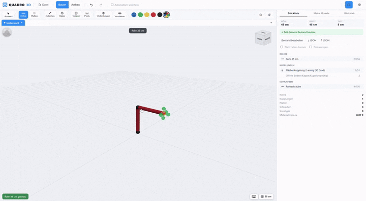
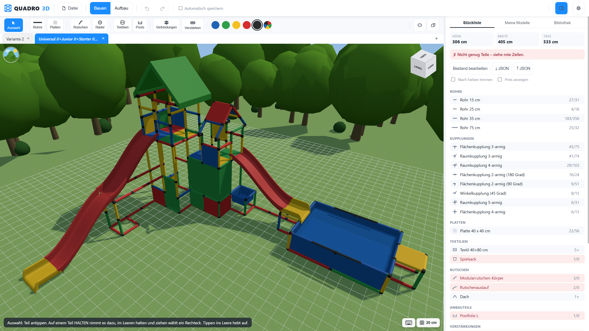
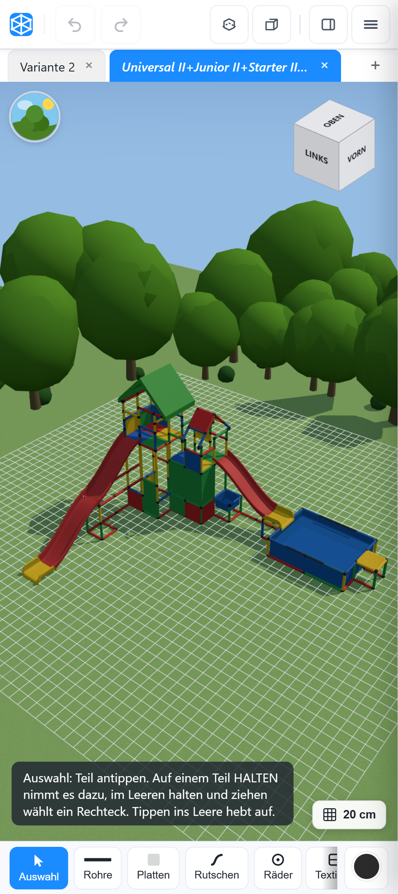

<div align="center">


# QUADRO 3D

**Planungstool für QUADRO-Klettergerüste · Planning tool for QUADRO climbing frames**

[](LICENSE)
[](web/js/)
[](web/vendor/three/)
[](https://thecodingdad.github.io/quadro-3D/)

[**→ App öffnen / Open the app**](https://thecodingdad.github.io/quadro-3D/)

[🇩🇪 Deutsch](#-deutsch) · [🇬🇧 English](#-english)



</div>

---

## 🇩🇪 Deutsch

### Was ist das?

QUADRO 3D ist eine **offline-fähige Web-App** zum Planen von
[QUADRO-Klettergerüsten](https://quadroshop.com) – der Nachbau der alten Windows-Software
„Quadro 3D", die heute reichlich altmodisch wirkt: umständliche Kamerasteuerung, keine
Aufbauanleitung. Genau das macht diese App besser.

Gebaut wird frei im Raum aus Kupplungen, Rohren und Platten. Dabei entstehen nebenbei:

- eine **Stückliste**, die sich mit jedem Handgriff mitzählt – samt Schrauben und Materialpreis
- ein **Machbarkeitscheck** gegen den eigenen Teile-Bestand
- ein **Aufbauplan**, Lage für Lage, zum Nachbauen

Keine Installation, kein Konto, keine Cloud: alles läuft im Browser, die Entwürfe bleiben auf
dem eigenen Rechner.

| Dekstop | Mobil |
|---|---|
|  |  |


### Was drin ist

**Bauen**

- **3D-Editor** – Kupplungen, Rohre, Bogenrohre und Platten frei im Raum setzen
- **45°-Winkelkupplung** – als Teil auf einen freien Arm setzen, per Klick weiterdrehen, Rohr daran hängen
- **Platten** – zwischen zwei parallelen Rohren, alle Katalogformate von 30×30 bis 80×80
- **Rutschen und Anbauteile** – Rutschen einhängen, Räder, Rollen, Lager, Netze, Rundabdeckung,
  Dach, Spielsack und Bällebad setzen
- **Alu-Verstärkungen** – Profile in Rohre schieben, kollineare Läufe werden zusammengefasst
- **Kopieren und Einfügen** – Auswahl mit Strg+C kopieren, mit Strg+V an den Zeiger hängen und
  per Klick absetzen, auch in einen anderen Entwurf
- **Tastatur** – Pfeiltasten bauen kamera-relativ, jedes Werkzeug hat ein Kürzel (F1 zeigt alle)

**Planen**

- **Stückliste** – Rohre, Kupplungen, Platten, Anbauteile, Verstärkungen und Schrauben, mit Preis
  je Zeile und Summe; ein Klick auf eine Zeile hebt die Teile im Modell hervor
- **Bestand & Machbarkeit** – eintragen, was im Keller liegt, und sofort sehen, ob es reicht
- **Aufbaumodus** – Lage für Lage durch den Bauplan
- **Modell-Bibliothek** – die eigene QDF-Sammlung einlesen, durchsuchen und filtern
  („nur mit meinem Bestand baubar")

**Dateien**

- **QDF-Import und -Export** – Entwürfe mit der Original-QUADRO-Software austauschen;
  Kupplungen, Anbauteile und Sonderteile gehen dabei unverändert wieder hinaus.
  Das Format ist in [QDF-FORMAT.md](docs/QDF-FORMAT.md) beschrieben – Element für Element,
  mit Angabe, wie sicher wir uns bei jedem Feld sind
- **Mehrere Entwürfe** – Tabs wie im Editor, mit Vorschau-Tabs wie in VS Code
- **Automatisch speichern** – nichts geht verloren, auch nicht beim Neuladen

**Drumherum**

- **Einführung** – beim ersten Start führt eine Demo durch die Oberfläche und hebt Areal für
  Areal hervor; überspringbar und in den Einstellungen jederzeit wieder zu starten
- **Zweisprachig** – Deutsch und Englisch, umschaltbar im laufenden Betrieb
- **Installierbar (PWA)** – als eigenes Fenster einrichten und offline weiterbauen
- **Mobil bedienbar** – im Hochformat wandert die Bauteil-Leiste nach unten, Werkzeuge klappen
  bei Platzmangel zusammen, der Aufbauplan liegt als Karte über der Szene
- **Optionaler Server** – Modelle, Bestand und Sammlung über mehrere Rechner teilen (siehe unten)
- **Ohne Build-Step** – Vanilla JS, keine Abhängigkeiten außer dem mitgelieferten Three.js

### Schnellstart

Einfach den [Link](https://thecodingdad.github.io/quadro-3D/) aufrufen – fertig. Wer die App
selbst hosten will, legt das Repository auf einen beliebigen statischen Webserver.

Lokal zum Ausprobieren oder Entwickeln:

```bash
python serve.py            # http://127.0.0.1:8000/web/index.html
```

> Für eigene Änderungen: Fork erstellen → Pages aktivieren (Settings → Pages → Branch `main`,
> Ordner `/`) → fertig.

### Optional: gemeinsamer Speicher (Server)

Wer an mehreren Rechnern plant, kann die gespeicherten Modelle, den eigenen Bestand und die
QDF-Sammlung auf einen kleinen Server legen. Am einfachsten mit dem fertigen Docker-Image – ohne
Klonen:

```bash
docker run -d -p 8000:8000 -v quadro-data:/data ghcr.io/thecodingdad/quadro-3d:1
# App: http://localhost:8000/web/index.html
```

Dasselbe mit Compose: die [`compose.yml`](compose.yml) neben sich legen und `docker compose up -d`.
Die Marke `:1` folgt jedem Minor und Patch der 1er-Reihe; wer eine feste Fassung will, nimmt
`:1.0.0`. Es gibt sie für **amd64 und arm64** (Raspberry Pi, ARM-NAS), auch als
`thecodingdad/quadro-3d` auf Docker Hub. Bei einem **Bind-Mount** statt eines Volumes einmal
`chown 1000:1000` auf das Verzeichnis – der Container läuft nicht als root.

Aus dem Quelltext bauen (Entwicklung):

```bash
docker compose -f compose.dev.yml up --build
```

Oder direkt mit Python (`pip install -r requirements.txt`):

```bash
python server.py 8000          # App + API aus einem Ursprung
QUADRO_DATA=/pfad/zu/daten python server.py
```

Der Server legt alles als gewöhnliche Dateien ab (`data-store/docs/*.json`,
`data-store/inventory.json`, `data-store/library/*.qdf`) – eine Sicherung ist ein simples
Kopieren.

Wissenswertes:

- **Der Browser bleibt der Arbeitsplatz.** Er hält weiterhin den ganzen Bestand; der Server ist
  die gemeinsame Ablage, mit der abgeglichen wird. Offene Tabs, ungespeicherte Stände und
  Einstellungen bleiben rein lokal.
- **Live:** speichert ein Rechner, laden die anderen das Modell sofort nach – sofern sie darin
  nichts Ungespeichertes haben. Sonst wird gefragt.
- **Ohne Server** (GitHub Pages, `serve.py`, oder Server gerade aus) läuft alles weiter;
  Änderungen gehen beim nächsten Verbinden hoch. Nur ein Eintrag der Sammlung, von dem noch kein
  QDF-Text im Browser liegt, lässt sich dann nicht öffnen – das sagt die App auch.
- **Wo man ihn sieht:** im Seitenleisten-Tab „Meine Modelle" steht eine Zeile mit dem Zustand –
  aber erst, sobald einmal eine Verbindung stand.

> [!NOTE]
> ⚠️ **Nur im eigenen Netz betreiben.** Der Server hat **keine Anmeldung, keine Rechte und keine
> Verschlüsselung**: wer ihn erreicht, darf alle Modelle lesen, ändern und löschen. Den Port also
> **nicht** im Router freigeben und nicht ins Internet stellen. Soll er von unterwegs erreichbar
> sein, gehört ein VPN davor oder ein Reverse-Proxy mit HTTPS und Anmeldung (`/api/ws` muss dabei
> als WebSocket durchgereicht werden). Ausgeliefert werden bewusst nur die Dateien der App
> (`/web`, `/data`, `/icons` und die drei Dateien im Wurzelverzeichnis) – das Datenverzeichnis und
> der Rest des Projekts bleiben außen vor.

### Lizenz

[MIT](LICENSE) – frei verwendbar, auch kommerziell. QUADRO ist eine Marke der QUADRO GmbH;
dieses Projekt steht in keiner Verbindung zum Hersteller.

---

## 🇬🇧 English

### What is this?

QUADRO 3D is an **offline-capable web app** for planning
[QUADRO climbing frames](https://quadroshop.com) – a rebuild of the old Windows program
"Quadro 3D", which feels rather dated today: awkward camera, no assembly instructions. That is
exactly what this app does better.

You build freely in space from connectors, tubes and panels, and get along the way:

- a **parts list** that counts itself as you build – screws and material price included
- a **feasibility check** against the parts you own
- an **assembly plan**, layer by layer, for the actual build

No installation, no account, no cloud: everything runs in the browser and your designs stay on
your own machine.

| Desktop | Mobile |
|---|---|
|  |  |


### What's inside

**Building**

- **3D editor** – place connectors, tubes, arc tubes and panels freely in space
- **45° angle connector** – place it on a free arm, click again to turn it, then attach a tube
- **Panels** – between two parallel tubes, every catalogue size from 30×30 to 80×80
- **Slides and fittings** – hook in slides, place wheels, casters, bearings, nets, round covers,
  roofs, the play bag and the ball pit
- **Aluminium reinforcements** – slide profiles into tubes; collinear runs are merged
- **Copy and paste** – Ctrl+C copies the selection, Ctrl+V attaches it to the pointer and a click
  puts it down, in another design as well
- **Keyboard** – arrow keys build relative to the camera, every tool has a shortcut (F1 lists them)

**Planning**

- **Parts list** – tubes, connectors, panels, fittings, reinforcements and screws, with a price per
  row and a total; clicking a row highlights those parts in the model
- **Stock & feasibility** – enter what you own and see at once whether it is enough
- **Assembly mode** – step through the build layer by layer
- **Model library** – read in your own QDF collection, search and filter it
  ("buildable with my stock only")

**Files**

- **QDF import and export** – exchange designs with the original QUADRO software; connectors,
  fittings and special parts are written back unchanged. The format is documented in
  [QDF-FORMAT.md](docs/QDF-FORMAT.md) – element by element, with a confidence level per field
- **Several designs** – tabs like in an editor, including preview tabs as in VS Code
- **Autosave** – nothing is lost, not even on a reload

**Around it**

- **Guided tour** – on the first start a demo walks through the interface, highlighting one area
  at a time; skippable and restartable from the settings at any time
- **Bilingual** – German and English, switchable while running
- **Installable (PWA)** – set it up as its own window and keep building offline
- **Works on mobile** – in portrait the part row moves to the bottom, tools collapse when space
  runs out, and the assembly plan floats above the scene
- **Optional server** – share models, stock and collection across machines (see below)
- **No build step** – vanilla JS, no dependencies beyond the bundled Three.js

### Quick start

Open the [link](https://thecodingdad.github.io/quadro-3D/) – done. To host it yourself, put the
repository on any static web server.

Locally, to try it out or to develop:

```bash
python serve.py            # http://127.0.0.1:8000/web/index.html
```

> To make your own changes: fork it → enable Pages (Settings → Pages → branch `main`, folder `/`)
> → done.

### Optional: shared storage (server)

If you plan on more than one machine, the saved models, your own stock and the QDF collection can
live on a small server. Easiest with the ready-made Docker image – no cloning:

```bash
docker run -d -p 8000:8000 -v quadro-data:/data ghcr.io/thecodingdad/quadro-3d:1
# app: http://localhost:8000/web/index.html
```

The same with Compose: put [`compose.yml`](compose.yml) next to you and run `docker compose up -d`.
The tag `:1` follows every minor and patch of the 1.x line; pin `:1.0.0` for a fixed version. It
comes for **amd64 and arm64** (Raspberry Pi, ARM NAS), and also as `thecodingdad/quadro-3d` on
Docker Hub. With a **bind mount** instead of a volume, `chown 1000:1000` the directory once – the
container does not run as root.

Building from source (development):

```bash
docker compose -f compose.dev.yml up --build
```

Or straight with Python (`pip install -r requirements.txt`):

```bash
python server.py 8000          # app + API from one origin
QUADRO_DATA=/path/to/data python server.py
```

The server keeps everything as plain files (`data-store/docs/*.json`,
`data-store/inventory.json`, `data-store/library/*.qdf`) – a backup is a plain copy.

Worth knowing:

- **The browser stays the workplace.** It still holds the whole set; the server is the shared
  storage it reconciles with. Open tabs, unsaved work and settings stay local.
- **Live:** when one machine saves, the others load the model right away – unless they hold
  unsaved work in it. Then they ask.
- **Without a server** (GitHub Pages, `serve.py`, or the server just being off) everything keeps
  working; changes go up on the next connection. Only an entry of the collection whose QDF text is
  not in the browser yet cannot be opened then – and the app says so.
- **Where you see it:** the sidebar tab "My models" carries a line with the state – but only once
  a connection has been up.

> [!NOTE]
> ⚠️ **Run it inside your own network only.** The server has **no authentication, no permissions
> and no encryption**: whoever reaches it may read, change and delete every model. So do **not**
> forward the port in your router and do not put it on the internet. To reach it from outside, put
> a VPN in front of it, or a reverse proxy that brings HTTPS and a login (`/api/ws` has to be
> passed through as a WebSocket). Only the files of the app are served on purpose (`/web`,
> `/data`, `/icons` and the three files in the root) – the data directory and the rest of the
> project stay out of reach.

### License

[MIT](LICENSE) – free to use, commercially as well. QUADRO is a trademark of QUADRO GmbH; this
project is not affiliated with the manufacturer.
